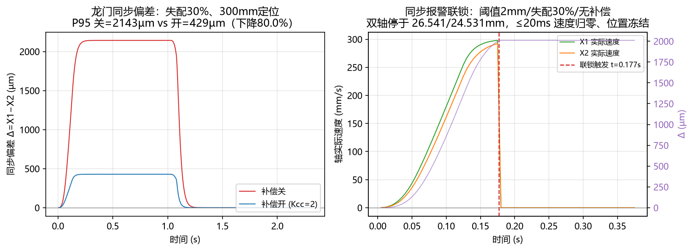
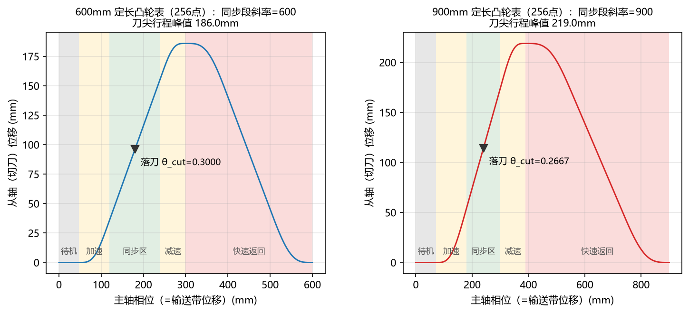

# 龙门双轴同步 与 电子凸轮·飞剪 —— 虚拟轴仿真（求职作品集项目）

[](https://github.com/lwj15089590118/Gantry-Sync-Cam-Simulation/actions/workflows/ci.yml)


用 **Python 3.12 + numpy + flask**（全部免费开源）从零实现的运动控制系统仿真：

- **虚拟伺服轴库**：脉冲当量、梯形/S 曲线规划、位置环增益产生跟随误差、
  负载扰动、软限位与报警锁存（锁存后仅可经 `jog_recover` 受控回退朝限位
  内侧低速点动，回位自动解除）—— 控制律与真实伺服系统同构；
- **龙门双轴同步**：主从指令 + 交叉耦合同步补偿（可开关）+ 同步偏差报警联锁，
  支持"补偿开/关 × 增益失配 5%~30%"矩阵对比实验；
- **电子凸轮·飞剪**：256 点凸轮表线性插值、运行中换表、飞剪四段循环
  （待机→加速追赶→同步切刀→快速返回），统计同步段速度误差与节拍；
- **Web 看板**：ECharts 曲线（双轴位置/同步偏差/凸轮表/飞剪速度）
  + Canvas 输送带切刀联动动画，参数在线可改。

> ## ⚠️ 免责声明
> 本项目**不含任何真实驱动器调试**。README 与报告中所有性能指标均为
> **仿真验证值**——由 Python 虚拟伺服轴数值仿真得出，不代表真实设备性能。
> 但系统结构、控制律与实验方法与真实运动控制系统一致，同步/凸轮的控制
> 思想可直接迁移到真机工程。

---

## 快速开始

```bash
# 0) 环境：Windows 10 + Python 3.12
pip install -r requirements.txt

# 1) 复现全部实验，生成 docs/测试报告.md（约 10 秒）
python -m testbench.batch_test

# 2) 启动 Web 看板，浏览器打开 http://127.0.0.1:5000
python dashboard/app.py        # 或直接双击 启动看板.bat

# 3) 各模块自测试（可选）
python axis/virtual_axis.py    # S曲线定位 + 跟随误差 = v/Kp 验证
python gantry/gantry.py        # 补偿开/关对比
python cam/electronic_cam.py   # 凸轮表斜率 + 飞剪运行 + 换产演示
```

## 性能指标（全部为仿真验证值）

| 指标 | 条件 | 数值 |
| --- | --- | --- |
| 恒速跟随误差 | v=80mm/s，Kp=40(1/s) | 实测 2.0000 mm = v/Kp 理论值 ✔ |
| 同步偏差 P95（无补偿） | 失配 5% / 30% | 263.2 µm / 2142.9 µm |
| 同步偏差 P95（补偿开） | 失配 5% / 30% | 52.8 µm / 428.7 µm |
| **交叉耦合补偿收益** | 全部失配档位 | **P95 下降 80.0%**（理论 1−1/(1+2Kcc)，Kcc=2） |
| 同步报警联锁 | 失配 30%、阈值 2mm | 无补偿触发联锁停机（报警后 ≤20ms 双轴速度归零、位置冻结、SYNC_EXCEED 锁存，须复位重走）；有补偿正常完成 |
| 软限位受控回退恢复 | SOFT_LIMIT 锁存后（batch_test 自检⑤） | 报警态朝外指令拒绝；回退实际速度 ≤ max_vel×25%（硬上限）；回位自动解除锁存、恢复正常定位 |
| 飞剪同步段速度误差均值 | 带速 700 mm/s | 0.65 mm/s（≈带速的 0.09%） |
| 飞剪循环节拍误差 | 定长 600mm、带速 400~1300 | 实测 vs 理论(L/v) 偏差 < 1 ms |

> 以上数值由 `python -m testbench.batch_test` 在本仓库代码上生成，
> 可一键复现；原始数据见 `docs/data/*.csv`。

## 实验曲线（真实仿真输出）

| 同步偏差与联锁停机 | 电子凸轮表（换产两档定长） |
| --- | --- |
|  |  |

- 左图（同步）：补偿开/关 Δ(t) 由 `gantry/gantry.py` 内核真实运行绘制（失配 30%、300mm 定位），
  P95 2143µm→429µm 与指标表一致；联锁子图为阈值 2mm 触发停机的实测速度序列（t=0.177s 触发，
  双轴停于 26.5/24.5mm，速度归零 ≤5ms、位置零漂移）。
- 右图（凸轮）：`cam/electronic_cam.py` 的 `build_flying_shear_table` 生成的 256 点表，
  同步段斜率=定长 L，落刀相位 θ_cut 随换产新表重算（0.3000→0.2667）。
- 以上曲线均为本项目仿真内核的一次性真实运行数据（matplotlib 渲染），与
  `python -m testbench.batch_test` 输出同源，可用 `docs/data/*.csv` 交叉核对。

## 目录结构

```text
├── axis/virtual_axis.py            # 虚拟伺服轴库
├── gantry/gantry.py                # 龙门双轴同步（交叉耦合补偿）
├── cam/electronic_cam.py           # 电子凸轮 + 飞剪
├── testbench/batch_test.py         # 参数扫描批量测试（核心产出）
├── dashboard/
│   ├── app.py                      # Flask 后端 API
│   └── templates/index.html        # ECharts 看板 + Canvas 动画
├── docs/
│   ├── 系统设计说明书.md            # 架构图/公式推导/时序图
│   ├── 测试报告.md                  # batch_test 自动生成
│   ├── 验收清单.md                  # 功能逐项验收
│   ├── 面试深挖10问.md              # 高频追问及回答要点
│   └── data/*.csv                  # 实验原始数据
├── resume/
│   ├── 项目总结.md                  # 第一人称项目总结（600字）
│   └── 简历项目描述.md              # 150字量化描述
├── requirements.txt
└── 启动看板.bat
```

## 看板功能

| 区域 | 内容 |
| --- | --- |
| 参数面板 | 增益失配度滑条(5~50%)、补偿开关、带速滑条、定长输入 |
| 双轴位置图 | 主轴指令 / X1 实际 / X2 实际三条曲线 |
| 同步偏差图 | Δ(t) 实时曲线 ± 报警阈值线 |
| 凸轮表图 | 256 点表曲线 + 待机/加速/同步/减速/返回分段着色 |
| 飞剪速度图 | 切刀实际速度 vs 带速虚线 |
| Canvas 动画 | 输送带滚动 + 产品等距移动 + 切刀按凸轮轨迹联动、落刀红闪、同步区绿条 |
| 报告内嵌 | 直接展示 docs/测试报告.md 全文 |

## FAQ（复审/面试高频问答）

**Q1：同步报警触发后，轴会怎样？会自己恢复吗？**
不会自己恢复。联锁动作链为：主轴斜坡停（滑行约 128ms 归零）→ 双从轴脱离目标流并
`disable()` 封锁输出（速度归零 ≤5ms、实际位置冻结零漂移）→ 控制器级 `SYNC_EXCEED`
报警锁存、进入 FAULTED——条件消失也不能自动复位，必须 `reset()` 复位后重走。
该行为由 batch_test 自检③b 自动断言（复审报告 05 P1-1 修复项）。

**Q2：SOFT_LIMIT 软限位报警怎么恢复？**
真实伺服的"受控回退"惯例：报警态输出封锁冻结、朝外指令一律拒绝，仅保留
`jog_recover()` 唯一通道——朝限位**内侧**低速点动（默认限速 20% max_vel，
可配 5%~25%，25% 为硬编码钳制上限），退回限位内越过 0.05mm 滞回带后锁存
自动解除、恢复正常定位（batch_test 自检⑤）。

**Q3：换产（改定长）后落刀相位怎么办？**
换表在周期边界生效并"重新定相"消除虚计落刀，同时用**新表** `seg_info` 重算
落刀相位 `theta_cut` 与统计内窗（600→900mm 时 θ_cut 0.3000→0.2667）。
回归断言：换产后首刀实测与按新表相位推算差 0.1ms（复审报告 05 P2-1 修复项）。

**Q4：电子凸轮表是怎么生成的？**
`build_flying_shear_table` 按飞剪工艺分段（待机→加速追赶→同步切刀→减速脱离→
快速返回）：在 8192 点细网格上构造速度形状函数 w(θ) 再积分成位移；**同步段斜率
恒等于定长 L**（刀带同速的核心设计规则），返回段峰值斜率由"周期位移净面积为零"
约束自动解出，最后采样成 256 点工程凸轮表（首尾闭合、支持周期回绕插值）。

**Q5：为什么交叉耦合补偿恰好收益 80%？**
两从轴跟随误差 e≈v/Kp，失配使 Δ=v/Kp2−v/Kp1；交叉耦合把偏差以 Kcc=2 对称反馈
回两轴目标，稳态 Δ 压缩为 1/(1+2Kcc)=1/5，即 P95 下降 80.0%——与四档失配实测
79.9%~80.0% 吻合，batch_test 自检① 按理论公式实时校验。

**Q6：实验结果可以复现吗？**
可以。`python -m testbench.batch_test` 约 1 秒跑完全部实验，报告结论由本次数据
实时计算（非写死），8 项数据一致性自检任一不过即非零码退出；CI（`.github/workflows/ci.yml`）
在每次 push 时执行 compileall + 三模块自测试 + batch_test 全量。

## Roadmap（真实规划，对应复审报告 05 残留 P3）

- [ ] ECharts 本地化到 `dashboard/static/`，消除 jsdelivr/unpkg CDN 依赖，支持完全离线演示（P3-10 残留）；
- [ ] 轴库预留 API 清理与标注（`wait_done` 忙等/`move_rel`/`*_pulses` 等）、到位窗口魔法数 20 参数化、`step(dt)`/`self.dt` 双通道收敛（P3-1/3/5 残留）；
- [ ] 实验矩阵扩充：负载失配 `load2_extra`、速度前馈 `vel_ff`（0/0.85/1）、梯形 vs S 曲线对比各做一组扫描，让闲置配置项变成有数据支撑的结论；
- [ ] 轻量 pytest 行为断言层，把联锁/换表/软限位等控制行为固化进 CI。

## 已知边界（诚实说明）

- 只建模位置环（一阶等效），未含电流/速度环细节、间隙与柔性；
- 数值结论用于验证控制思想，不能替代真机的驱动器整定；
- 真机还需完成：惯量比辨识、增益整定、前馈配置、机械谐振陷波等调试。

## 许可证

[MIT License](LICENSE)（版权人 lwj15089590118）。仅供学习与求职作品集展示使用。
