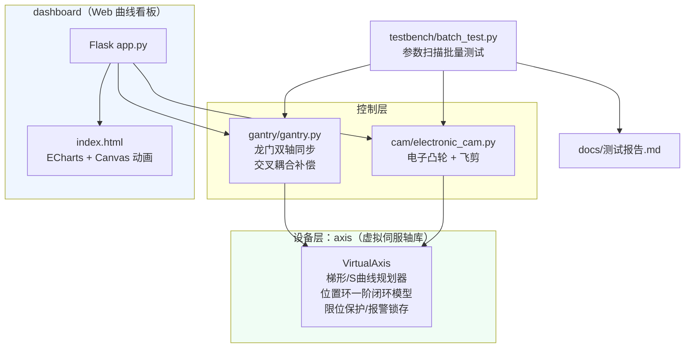

# 系统设计说明书：龙门双轴同步与电子凸轮·飞剪 虚拟轴仿真

> **免责声明**：本项目不含任何真实驱动器调试。全部结果与指标均为
> **仿真验证值**（Python 数值仿真），但控制律结构与真实运动控制系统同构，
> 同步/凸轮的控制思想一致。

---

## 1 系统架构



分层职责：

| 层 | 文件 | 职责 |
| --- | --- | --- |
| 设备层 | `axis/virtual_axis.py` | 把"一台伺服轴"抽象为可仿真的对象：指令规划、闭环滞后、脉冲当量、保护 |
| 控制层 | `gantry/gantry.py` | 主从指令分配、同步偏差监测、交叉耦合同步补偿（可开关） |
| 控制层 | `cam/electronic_cam.py` | 凸轮表生成/插值/切换，飞剪循环与工艺指标 |
| 测试层 | `testbench/batch_test.py` | 补偿×失配矩阵、报警联锁演示、带速扫描 → 生成测试报告 |
| 展示层 | `dashboard/app.py` + `templates/index.html` | 在线改参数跑实验，曲线可视化 + 飞剪动画 |

运行数据流：所有层共用 1ms 控制周期 `dt`，每个周期依次执行
"规划/指令分配 → 闭环被控对象积分 → 保护检查"，与真实总线型系统的
循环执行方式同构。

---

## 2 虚拟伺服轴模型

### 2.1 规划器：梯形 / S 曲线

点到点定位按"剩余距离减速约束"实时规划（数字系统常用做法）：

- 梯形速度规划：本周期允许速度取

  $$v_{allow} = \min\big(v_{profile},\ \sqrt{2 a_{max} d_{remain}}\big)$$

  其中 $d_{remain}$ 为剩余距离，$\sqrt{2ad}$ 保证恰好能在剩余距离内减速到 0。
- S 曲线（加加速度限制）：对加速度再做斜率限制

  $$|\dot{a}| \le J_{max} \quad\Rightarrow\quad a_k = a_{k-1} \pm J_{max}\,T$$

  加速度连续 → 速度平滑无拐点 → 减少机械冲击与过冲。
  本实现中 `use_s_curve=False` 时 $J_{max}\to\infty$，退化为标准梯形。

### 2.2 闭环被控对象与跟随误差推导

真实 P 位置环伺服的闭环特性近似为一阶滞后。虚拟轴用同一结构：

$$\frac{dp_{act}}{dt} = K_p\,\big(p_{cmd}-p_{act}\big) - d_{load} + K_{fv}\,(v_{cmd}+d_{load})$$

令跟随误差 $e = p_{cmd} - p_{act}$，恒速段 $\dot e = 0$ 时：

$$e_{ss} = \frac{(1-K_{fv})\,(v_{cmd}+d_{load})}{K_p}
\;\xrightarrow{K_{fv}=0}\;
\boxed{e_{ss} = \frac{v}{K_p}}$$

**结论**：跟随误差正比于速度、反比于位置环增益；两轴增益或负载不同，
误差就不同 —— 这正是龙门同步偏差的物理根源。速度前馈系数 $K_{fv}$
可按比例压缩稳态误差（工程上常配 0.8~0.95）。

自测验证：`python axis/virtual_axis.py` 中 v=80mm/s、Kp=40(1/s)，
实测稳态误差 2.0000mm = 80/40，**与理论完全一致（仿真验证值）**。

### 2.3 脉冲当量与量化

上位机以脉冲计数表达位置：`脉冲数 = 工程量 × pulse_per_unit`
（如 1000 脉冲/mm，分辨率 1µm）。仿真中每周期把指令位置量化到一个
脉冲分辨率后再进入闭环，复现真实接口的离散化行为。

### 2.4 保护逻辑

- 软限位：实际位置越界 → 锁存报警 `SOFT_LIMIT` 并停机；
- 跟随误差超差：|e| 超阈值 → 锁存报警 `FOLLOWING_ERROR`；
- 同步偏差超限（龙门）：由上层控制器锁存 `SYNC_EXCEED` 并执行联锁
  停机（见 §3.5）；
- 去使能/报警期间：输出封锁，实际位置与实际速度冻结（模拟驱动器
  下电/抱闸），不会被闭环拉向指令位置；
- 报警锁存后禁止使能，须条件消失后 `clear_alarm()` 才能复位——
  与真实驱动器"故障不复位不能再上电"的安全习惯一致。

---

## 3 龙门双轴同步

### 3.1 结构

```mermaid
graph LR
    M[MASTER 主轴<br/>轨迹发生器] -- "目标流 m(t)" --> A[X1 从轴<br/>Kp1=60/s]
    M -- "目标流 m(t)" --> B[X2 从轴<br/>Kp2=Kp1×(1−失配)]
    A -- act1 --> CMP{{交叉耦合补偿器}}
    B -- act2 --> CMP
    CMP -- "m − Kcc·Δ" --> A
    CMP -- "m + Kcc·Δ" --> B
    CMP -- "|Δ|=|act1−act2|>阈值 → 停机" --> ALM[同步报警联锁]

    style CMP fill:#fef9c3
```

### 3.2 为什么会失配？

两台电机的位置环增益由 编码器分辨率×丝杠导程×驱动器参数 共同决定，
机械与电气公差使其不可能严格相等；两侧导轨摩擦/负载也常有差异。
设失配度 δ：$K_{p2} = K_{p1}(1-\delta)$，恒速下两轴跟随误差不同：

$$\Delta = act_1 - act_2 = e_2 - e_1 = \frac{v}{K_{p2}} - \frac{v}{K_{p1}}
= \frac{v}{K_{p1}}\cdot\frac{\delta}{1-\delta} \neq 0$$

### 3.3 交叉耦合同步补偿及其稳态精度推导

补偿律（对称反馈）：
$$tgt_1 = m - K_{cc}\Delta,\qquad tgt_2 = m + K_{cc}\Delta,
\qquad \Delta = act_1 - act_2$$

在恒速段求稳态：记 $x=a_1-m,\ y=a_2-m$，则

$$0=-K_{p1}(x+K_{cc}\Delta)-v,\quad 0=-K_{p2}(y-K_{cc}\Delta)-v$$

两式相减得**稳态同步偏差**：

$$\Delta^* = \frac{v\,(1/K_{p2}-1/K_{p1})}{1+2K_{cc}}
\;\overset{K_{cc}\to\infty}{\longrightarrow}\; 0$$

即交叉耦合把偏差压缩为开环值的 $1/(1+2K_{cc})$；$K_{cc}=2$ 时理论下降
80%。**实验吻合**（见 docs/测试报告.md，仿真验证值）：
30% 失配下 P95 从 2142.9µm 降到 428.7µm，下降 80.0%。

### 3.4 与"主从随动"方案的对比

主从式把 X1 的实际位置直接当作 X2 的目标（X2 跟 X1），结构简单，但
X2 的跟踪滞后全部进入同步偏差且无法利用"两轴对称纠偏"；交叉耦合把
Δ 作为受控量构造内环，对两轴增益差异不敏感，稳态同步精度由
$1/(1+2K_{cc})$ 决定，是双驱龙门的主流方案（详见面试问答第 2 题）。

### 3.5 安全联锁（同步超差停机）

任一周期检测到 $|\Delta|$ > 阈值，控制器执行真实的联锁停机动作链
（代码路径见 `gantry/gantry.py` 的 `_trigger_sync_interlock`）：

1. **主轴停令**：MASTER 轨迹发生器按加速度限幅斜坡停车，目标流归零；
2. **双从轴封锁输出**：X1/X2 脱离目标流、立即去使能（实际位置/速度
   冻结，不再走完全程），并锁存 `SYNC_EXCEED` 报警码——实测报警后
   20ms 内双轴速度归零、停机后位置零漂移；
3. **FAULTED 状态**：补偿停用、不再下发任何目标，须 `reset()` 复位
   重建后才能重新定位（对应真实系统"故障复位才能重走"）。

演示工况（30% 失配、阈值 2mm）：无补偿触发联锁停机（双轴停于行程
中段，停机耗时 ≤20ms），有补偿正常完成（仿真验证值，可复现命令见
README；停机过程由 testbench 自检项"报警联锁停机真实性"自动断言）。

---

## 4 电子凸轮

### 4.1 插值原理

凸轮表是离散点列 $(x_i, y_i)$，$i=0..255$，$x$ 为主轴一个周期的位移。
运行时主轴位置 $m$ 按周期回绕后线性插值：

$$\theta = m \bmod L,\qquad
y_{ref}(\theta) = y_i + (y_{i+1}-y_i)\,\frac{\theta - x_i}{x_{i+1}-x_i},
\quad x_i \le \theta < x_{i+1}$$

从轴以 `set_stream_target(y_ref)` 直通跟随该目标流（电子齿轮 1:1 行为），
跟随滞后同样由 §2.2 的一阶闭环产生。换表只需替换点列，在周期边界
（刀具回到待机位）执行切换即可保证位置连续 —— "软件凸轮"换产不停机。

### 4.2 飞剪凸轮表设计规则

飞剪要求切刀期间刀与带**同速**（否则切断面斜口/拉料）。输送带即主轴，
速度 $v_{belt}$，定长 $L$（每周期带走长度）。刀的水平速度：

$$v_{knife} = \frac{dy}{dt} = \frac{dy}{d\theta}\cdot\frac{d\theta}{dt}
= \frac{dy}{d\theta}\cdot\frac{v_{belt}}{L}$$

$$v_{knife}=v_{belt} \iff \frac{dy}{d\theta}=L$$

**核心设计规则：表中同步段的斜率必须等于定长 L**
（对应"物理斜率" dy/dm = 1，即刀带同速）。

### 4.3 一个循环的分段（时序）

```mermaid
gantt
    title 飞剪一个循环（相位 θ = 输送带走行比例，示例定长600mm）
    dateFormat X
    axisFormat %s
    section 剪切轴
    待机区 (刀停在等待位, 斜率0)      :done, s0, 0,   0.08
    加速追赶 (斜率 0→L 平滑过渡)       :active, s1, 0.08, 0.22
    同步区·切刀 (斜率=L 刀带同速)      :crit,  s2, 0.22, 0.42
    减速脱离 (斜率 L→0)               :s3, 0.42, 0.52
    快速返回 (负向梯形速度回起点)      :s4, 0.52, 1.00
```

落刀时刻取同步区中点；返回段峰值速度由"面积约束"
∫w dθ = 0（一个周期位移净变化为零）自动解出。

### 4.4 关键指标口径

- 同步段速度误差：$|v_{knife}(t)-v_{belt}|$ 在同步内窗（避开加减速边缘）
  内统计均值/最大值；
- 循环节拍：相邻两次落刀的时间间隔，理论值 $L/v_{belt}$。
- 实测（仿真验证值）：700mm/s 带速下误差均值 0.65mm/s、节拍 857.2ms
  （理论 857.1ms）；全带速范围结论见测试报告。

---

## 5 目录结构与复现

```text
Gantry-Sync-Cam-Simulation/
├── axis/virtual_axis.py        # 虚拟伺服轴库（可直接运行自测试）
├── gantry/gantry.py            # 龙门双轴同步（可直接运行自测试）
├── cam/electronic_cam.py       # 电子凸轮+飞剪（可直接运行自测试）
├── testbench/batch_test.py     # 参数扫描 → docs/测试报告.md
├── dashboard/app.py            # Flask 后端
├── dashboard/templates/index.html  # ECharts 看板 + Canvas 动画
├── docs/                       # 设计说明书 / 测试报告 / 数据 CSV
└── resume/                     # 求职材料
```

```bash
pip install -r requirements.txt
python -m testbench.batch_test   # 复现全部实验与报告
cmd /c 启动看板.bat              # 或 python dashboard/app.py → http://127.0.0.1:5000
```

## 6 仿真与真实系统的差距（诚实边界）

| 项目 | 本仿真 | 真实系统 |
| --- | --- | --- |
| 内环 | 只建位置环（一阶等效） | 电流环+速度环+位置环三环级联 |
| 机械 | 无间隙/柔性/共振 | 需考虑反向间隙、弹性变形、机械谐振 |
| 反馈 | 理想编码器+量化 | 噪声、温漂、光栅尺安装误差 |
| 参数辨识 | 直接给定 | 需要 servo tune（惯量比辨识、陷波滤波等） |

因此本项目数值是**仿真验证值**，用于验证控制思想与算法逻辑；
真机上线前仍需完整的驱动器调试流程（见面试问答第 9 题）。
